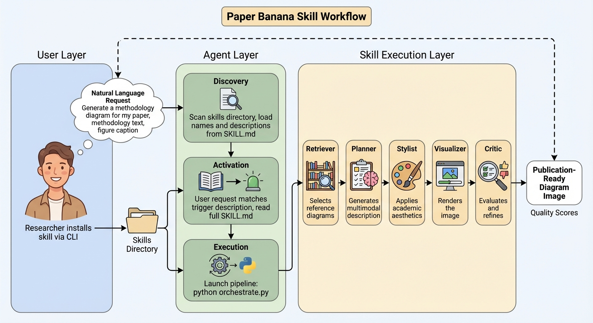
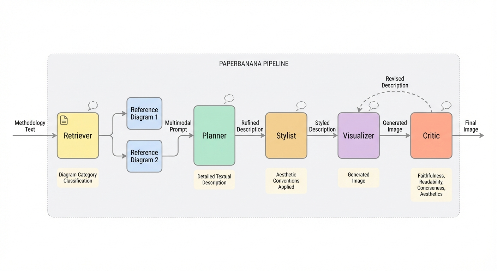

# Paper Banana Skill

[](https://opensource.org/licenses/MIT)
[](https://www.python.org/downloads/)
[](https://agentskills.io)

An agentic skill framework to generate publication-ready academic diagrams from methodology text. Five-agent Gemini pipeline implementing PaperBanana (arXiv:2601.23265). Install it, ask your agent to make a figure, and it handles the rest.

Based on [PaperBanana](https://arxiv.org/abs/2601.23265) (Zhu et al., 2026) — a five-agent pipeline powered by Gemini.

## Install

One command. Works with any [Agent Skills-compatible](https://agentskills.io) platform:

```bash
npx skills add javidmardanov/paper-banana-skill
```

> **Works with:** Claude Code, Cursor, Gemini CLI, GitHub Copilot, Amp, OpenCode, Goose, Roo Code, Windsurf, and [25+ other agents](https://agentskills.io).

Then set up the API key and dependencies:

```bash
export GOOGLE_API_KEY="your-key"  # Free tier: https://aistudio.google.com/apikey
pip install -r requirements.txt
```

## Usage

Once installed, just ask your agent in natural language:

> "Generate a methodology diagram for my transformer architecture. Here is the methodology section: [paste text]."

> "Create a bar chart comparing model accuracy. Data: {BERT: 92.3, GPT-4: 88.1, Claude: 95.7}."

> "Improve the aesthetics of this figure: [paste description or attach image]"

Your agent reads the skill's instructions, runs the pipeline scripts, and returns the result. No manual setup beyond the install step.

You can also run the pipeline directly:

```bash
python skills/paper-banana/scripts/orchestrate.py \
  --methodology-file methodology.txt \
  --caption "Figure 1: Overview of proposed framework" \
  --mode diagram --output output/diagram.png
```

## How the Skill Works

*Both diagrams below were generated by the skill itself.*

<p align="center">
  
</p>

You ask your agent in natural language. The agent discovers the skill, reads its instructions, and launches the pipeline — no manual setup beyond install.

## Inside the Pipeline

<p align="center">
  
</p>

Five specialized agents run sequentially, each a separate Gemini API call:

| Agent | Role | Model |
|-------|------|-------|
| **Retriever** | Classifies methodology, picks 2 reference diagrams from 13 curated examples | gemini-2.0-flash |
| **Planner** | Sends reference images + text as multimodal prompt, generates detailed description | gemini-2.0-flash |
| **Stylist** | Applies NeurIPS 2025 aesthetic conventions | gemini-2.0-flash |
| **Visualizer** | Renders the styled description into an image | gemini-2.0-flash (image gen) |
| **Critic** | Scores faithfulness, readability, conciseness, aesthetics (1-10) | gemini-2.0-flash |

If faithfulness or readability fall below 7, the Critic revises the description and loops back to the Visualizer (up to 3 times).

**Two modes:**
- **Diagram mode** — full pipeline, generates images via Gemini
- **Plot mode** — generates executable Python matplotlib/seaborn code (code-based = no data hallucination)

## What's in the Skill

```
skills/paper-banana/
├── SKILL.md                        # The skill — agent reads this to know what to do
├── scripts/                        # Pipeline scripts the agent executes
│   ├── orchestrate.py              # End-to-end pipeline runner
│   ├── retriever.py                # Reference selection
│   ├── planner.py                  # Multimodal description generation
│   ├── stylist.py                  # Style application
│   ├── critic.py                   # Image evaluation
│   ├── generate_image.py           # Gemini image generation
│   ├── plot_generator.py           # Matplotlib plot generator
│   └── validate_output.py          # Dependency checker
├── references/                     # Style guides, prompt templates, evaluation rubric
└── assets/
    ├── references/                 # 13 curated NeurIPS 2025 methodology diagrams
    ├── palettes/                   # Color palettes (colorblind-safe)
    └── matplotlib_styles/          # Academic .mplstyle files
```

## Contributing

Contributions welcome! Some areas where help is needed:

- **More reference diagrams** — the paper uses 292, we have 13. More examples improve the Planner's multimodal learning.
- **Stricter Critic** — the evaluation agent tends to be generous. A more discerning Critic would better leverage the refinement loop.
- **SVG/vector output** — currently raster only.
- **Additional style guides** — ICML, CVPR, ICLR formatting conventions.

Please open an issue first to discuss what you'd like to change.

## Disclaimer

This is an **unofficial** community implementation inspired by the PaperBanana paper. It is not affiliated with, endorsed by, or connected to the original authors, Google Research, or Peking University.

## Citation

This skill implements concepts from:

> Dawei Zhu, Rui Meng, Yale Song, Xiyu Wei, Sujian Li, Tomas Pfister, Jinsung Yoon.
> *PaperBanana: Automating Academic Illustration for AI Scientists.*
> [arXiv:2601.23265](https://arxiv.org/abs/2601.23265), 2026.

- [Official project page](https://dwzhu-pku.github.io/PaperBanana/)
- [Reference implementation](https://github.com/llmsresearch/paperbanana) (unofficial, MIT)

Bundled reference diagrams are from open-access arXiv papers, sourced via the [llmsresearch/paperbanana](https://github.com/llmsresearch/paperbanana) dataset (MIT). Each image is attributed by arXiv ID.

## License

[MIT](LICENSE)
