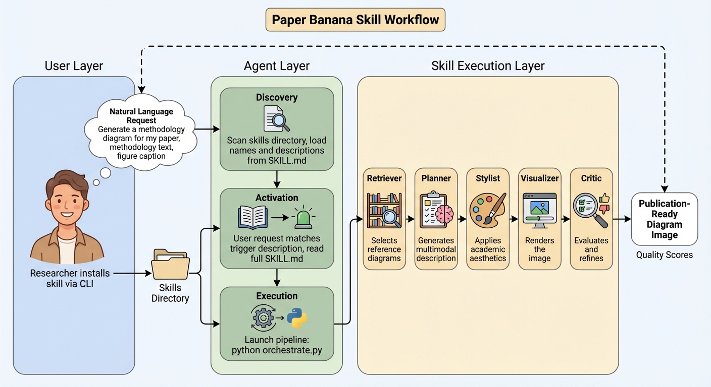
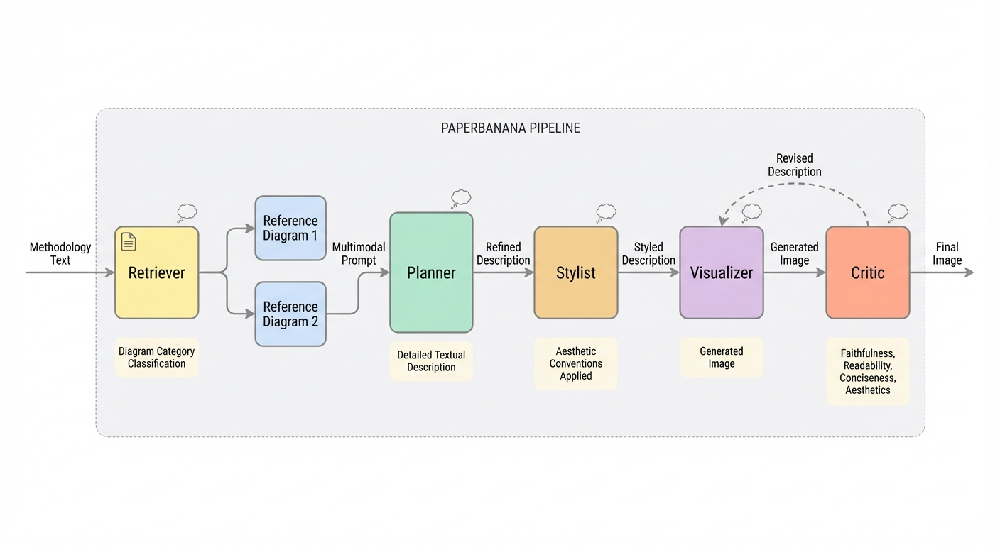

# Paper Banana Skill

[](https://opensource.org/licenses/MIT)
[](https://www.python.org/downloads/)
[](https://github.com/javidmardanov/paper-banana-skill/actions/workflows/ci.yml)
[](https://skills.sh)

Generates publication-ready academic diagrams from methodology text (or a paper PDF), improves figures you already have, and produces conference-styled plots from data. Ships with 13 curated reference diagrams, style packs for NeurIPS, ICLR, ICML, CVPR, ACL, and AAAI, and works with Gemini, OpenAI, Anthropic, or OpenRouter models.

Based on [PaperBanana](https://arxiv.org/abs/2601.23265) (Zhu et al., 2026): a five-agent pipeline of Retriever, Planner, Stylist, Visualizer, and Critic.

## Install

One command. Works with any [Agent Skills-compatible](https://skills.sh) platform:

```bash
npx skills add javidmardanov/paper-banana-skill
```

> **Works with:** Claude Code, Codex, Cursor, Gemini CLI, GitHub Copilot, Amp, Cline, Kimi Code CLI, and OpenCode.

Then set up an API key and install dependencies. The defaults use Google Gemini:

**macOS / Linux (bash/zsh):**

```bash
export GOOGLE_API_KEY="your-key"
pip install -r requirements.txt
```

**Windows (PowerShell):**

```powershell
$env:GOOGLE_API_KEY = "your-key"
pip install -r requirements.txt
```

> Get a free Gemini key at [aistudio.google.com/apikey](https://aistudio.google.com/apikey). `GEMINI_API_KEY` works too.
>
> To persist the key across sessions, add the export to your shell profile (`~/.bashrc`, `~/.zshrc`) or on Windows use `[System.Environment]::SetEnvironmentVariable("GOOGLE_API_KEY", "your-key", "User")`.
>
> To use OpenAI, Anthropic, or OpenRouter models, or to read PDFs, also run `pip install -r requirements-optional.txt` and see [Choosing models and providers](#choosing-models-and-providers).
>
> Verify packages, keys, and model access: `python skills/paper-banana/scripts/validate_output.py --check-deps --check-api`

## Usage

Once installed, just ask your agent in natural language:

> "Generate a methodology diagram for my transformer architecture. Here is the methodology section: [paste text]."

> "Make a figure for the method in paper.pdf, pages 3 to 5, in ICML style."

> "Improve this figure: [attach image]. It should match the methodology section: [paste text]."

> "Create a bar chart comparing model accuracy. Data: {BERT: 92.3, GPT-4: 88.1, Claude: 95.7}."

Your agent reads the skill's instructions, runs the pipeline scripts, and returns the result.

You can also run the pipeline directly:

```bash
python skills/paper-banana/scripts/orchestrate.py \
  --methodology-file paper.pdf --pages 3-5 \
  --caption "Figure 1: Overview of proposed framework" \
  --venue icml --figure-width double \
  --num-candidates 4 \
  --output output/diagram.png
```

| Flag | What it does |
|------|--------------|
| `--methodology-file` | `.txt`, `.md`, `.tex` (LaTeX noise stripped), or `.pdf` (add `--pages 3-5`) |
| `--venue`, `--figure-width` | Style pack and typeset width (`single` column or `double` = full text width). Venues: `neurips`, `iclr`, `icml`, `cvpr`, `acl`, `aaai` |
| `--num-candidates N` | Render N images in parallel on the first pass; the Critic keeps the best and refines it |
| `--input-image` | Improve an existing figure: the Planner sees it and the Visualizer edits it |
| `--image-size` | `1K`, `2K` (default), or `4K` |
| `--resume` | Reuse Retriever/Planner/Stylist outputs already in the work dir (re-render only) |
| `--vlm-model`, `--image-model` | Override models, e.g. `openai/gpt-5.5`, `openai/gpt-image-2` |
| `--references-dir` | Your own reference diagrams (see below) |

Every Visualizer attempt is kept under `output/work/`, and the run ends with a per-model token and image usage summary.

## Choosing models and providers

Models are named `provider/model`. Unprefixed names are inferred from the model family. Set them with environment variables or the flags above.

| Provider | Key | Reasoning agents | Visualizer | Example models |
|----------|-----|------------------|------------|----------------|
| Google Gemini (default) | `GOOGLE_API_KEY` | yes | yes | `gemini-3.5-flash`, `gemini-3.1-flash-lite`, `gemini-3-pro-image`, `gemini-3.1-flash-image` |
| OpenAI | `OPENAI_API_KEY` | yes | yes | `openai/gpt-5.5`, `openai/gpt-5.4-mini`, `openai/gpt-image-2`, `openai/gpt-image-1.5` |
| Anthropic | `ANTHROPIC_API_KEY` | yes | no | `anthropic/claude-opus-5`, `anthropic/claude-sonnet-5` |
| OpenRouter | `OPENROUTER_API_KEY` | yes | yes | `openrouter/google/gemini-3.5-flash`, `openrouter/google/gemini-3-pro-image` |

```bash
# Defaults: Gemini 3.5 Flash for reasoning, Nano Banana Pro for rendering
export GOOGLE_API_KEY="..."

# GPT for reasoning, GPT Image 2 for rendering
export OPENAI_API_KEY="..."
export PAPERBANANA_VLM_MODEL="openai/gpt-5.5"
export PAPERBANANA_IMAGE_MODEL="openai/gpt-image-2"

# Claude for reasoning, Nano Banana Pro for rendering (Claude does not generate images)
export ANTHROPIC_API_KEY="..." GOOGLE_API_KEY="..."
export PAPERBANANA_VLM_MODEL="anthropic/claude-opus-5"

# Everything through one OpenRouter key
export OPENROUTER_API_KEY="..."
export PAPERBANANA_VLM_MODEL="openrouter/google/gemini-3.5-flash"
export PAPERBANANA_IMAGE_MODEL="openrouter/google/gemini-3-pro-image"
```

Cost notes: `gemini-3.1-flash-lite` and `gpt-5.4-mini` are the cheap reasoning options; `gemini-3.1-flash-image` renders at roughly half the price of `gemini-3-pro-image`. `PAPERBANANA_OPENAI_IMAGE_QUALITY` (`low`, `medium`, `high`) tunes GPT Image cost. Anthropic models handle the four reasoning agents only, so pair them with a Gemini, OpenAI, or OpenRouter image model.

> **Upgrading from 1.0?** Google shut down `gemini-2.0-flash` (June 1, 2026) and `gemini-3-pro-image-preview` (June 25, 2026), so 1.0 no longer works. Re-run the install command.

## How the Skill Works

*Both of the images below were generated using this skill.*

<p align="center">
  
</p>

You ask your agent in natural language. The agent discovers the skill, reads its instructions, and launches the pipeline.

## Inside the Pipeline

<p align="center">
  
</p>

Five specialized agents run in sequence, each a separate API call to the configured model:

| Agent | Role | Default model |
|-------|------|---------------|
| **Retriever** | Classifies the methodology, picks 2 reference diagrams from the curated set | gemini-3.5-flash |
| **Planner** | Sees the reference images (and your existing figure, if any) and writes a detailed description | gemini-3.5-flash |
| **Stylist** | Applies the style guide plus the target venue's typesetting constraints | gemini-3.5-flash |
| **Visualizer** | Renders the description, or edits your existing figure | gemini-3-pro-image (Nano Banana Pro) |
| **Critic** | Scores faithfulness, readability, conciseness, aesthetics (1-10) | gemini-3.5-flash |

With `--num-candidates N` the Visualizer renders N images in parallel and the Critic scores each. If the best one still scores below 7 on faithfulness or readability, the Critic rewrites the description and the loop repeats (up to 3 passes). The best-scoring image is copied to the output path.

**Two modes:**
- **Diagram mode**: the full pipeline above
- **Plot mode**: executable matplotlib/seaborn code sized to the venue's column width (code-based = no data hallucination)

## What's in the Skill

```
skills/paper-banana/
├── SKILL.md                        # The skill: agent reads this to know what to do
├── scripts/
│   ├── orchestrate.py              # End-to-end pipeline runner
│   ├── providers.py                # Gemini / OpenAI / Anthropic / OpenRouter adapters
│   ├── common.py                   # Shared helpers: input loading, venues, model config
│   ├── retriever.py                # Reference selection
│   ├── planner.py                  # Multimodal description generation
│   ├── stylist.py                  # Style + venue application
│   ├── critic.py                   # Image evaluation
│   ├── generate_image.py           # Image generation / editing
│   ├── plot_generator.py           # Matplotlib plot generator
│   └── validate_output.py          # Dependency, API, and output checks
├── references/                     # Style guides, prompt templates, evaluation rubric
└── assets/
    ├── references/                 # 13 curated NeurIPS 2025 methodology diagrams
    ├── venues.json                 # Column widths and style notes per venue
    ├── palettes/                   # Color palettes (colorblind-safe)
    └── matplotlib_styles/          # Academic .mplstyle files
tests/                              # pytest suite; runs without API keys
```

## Custom Reference Images

You can use your own diagrams as visual references. The Planner learns style and layout from these images, so better references mean better output.

Create a folder with your images and an `index.json`:

```
my-references/
├── index.json
├── diagram_01.jpg
└── diagram_02.jpg
```

Each entry in `index.json`:

```json
[
  {
    "id": "diagram_01",
    "file": "diagram_01.jpg",
    "category": "Science & Applications",
    "caption": "Brief description of what this diagram shows"
  }
]
```

Then pass it to the pipeline with `--references-dir my-references/`, or drop images into `skills/paper-banana/assets/references/` and update the existing `index.json`.

## Development

```bash
pip install -r requirements-dev.txt
python -m pytest -q          # 50+ tests, all providers mocked, no keys needed
python -m pyflakes skills/paper-banana/scripts/*.py tests/*.py
```

CI runs the same on every push (Python 3.10 and 3.12).

## Contributing

Contributions welcome! Some areas where help is needed:

- **PaperBananaBench downloader**: we bundle 13 references; the authors released the full 292-case [PaperBananaBench](https://github.com/dwzhu-pku/PaperBanana). An optional fetch into `--references-dir` would improve the Planner's in-context learning.
- **Stricter Critic**: the evaluation agent tends to be generous. A more discerning Critic would better leverage candidates and the refinement loop.
- **SVG/vector output**: currently raster only.
- **More venue packs**: `assets/venues.json` is easy to extend (widths plus style notes).

Please open an issue first to discuss what you'd like to change.

## Disclaimer

This is an **unofficial** community implementation inspired by the PaperBanana paper. It is not affiliated with, endorsed by, or connected to the original authors, Google Research, or Peking University.

## Citation

This skill implements concepts from:

> Dawei Zhu, Rui Meng, Yale Song, Xiyu Wei, Sujian Li, Tomas Pfister, Jinsung Yoon.
> *PaperBanana: Automating Academic Illustration for AI Scientists.*
> [arXiv:2601.23265](https://arxiv.org/abs/2601.23265), 2026.

- [Official project page](https://dwzhu-pku.github.io/PaperBanana/)
- [Official code and PaperBananaBench](https://github.com/dwzhu-pku/PaperBanana) (Apache-2.0)
- [Reference implementation](https://github.com/llmsresearch/paperbanana) (unofficial, MIT)

Bundled reference diagrams are from open-access arXiv papers, sourced via the [llmsresearch/paperbanana](https://github.com/llmsresearch/paperbanana) dataset (MIT). Each image is attributed by arXiv ID.

## Changelog

See [CHANGELOG.md](CHANGELOG.md).

## License

[MIT](LICENSE)
